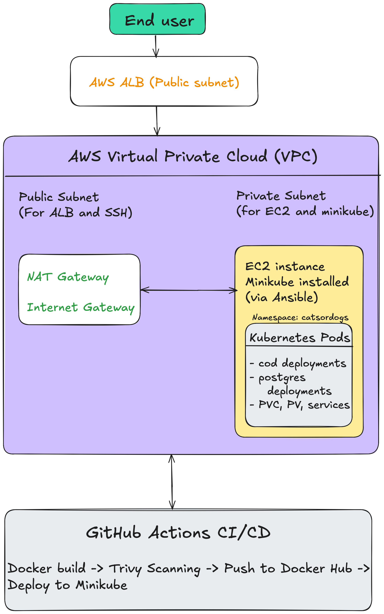
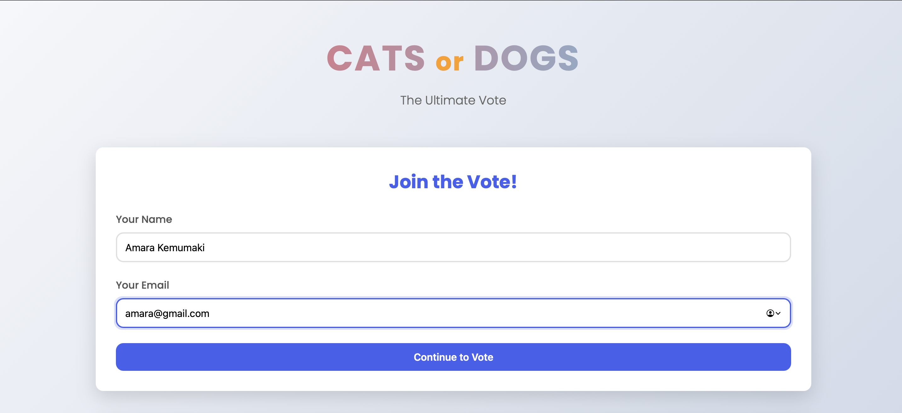
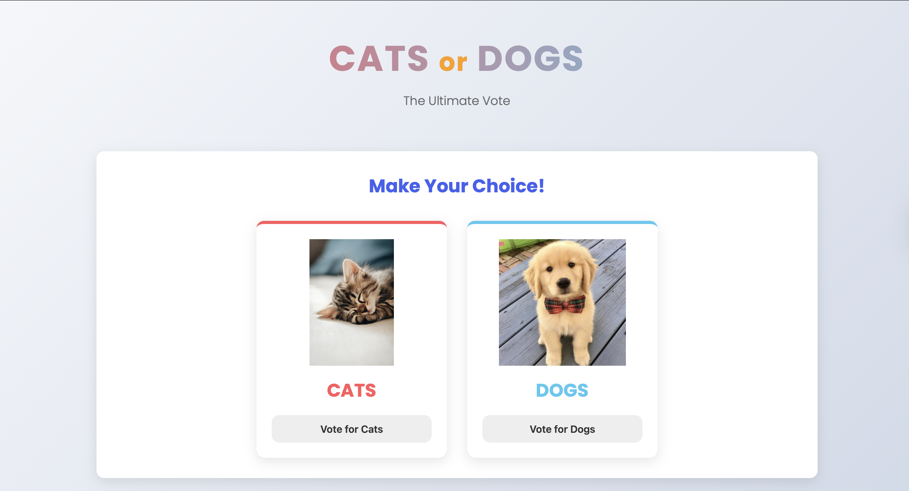
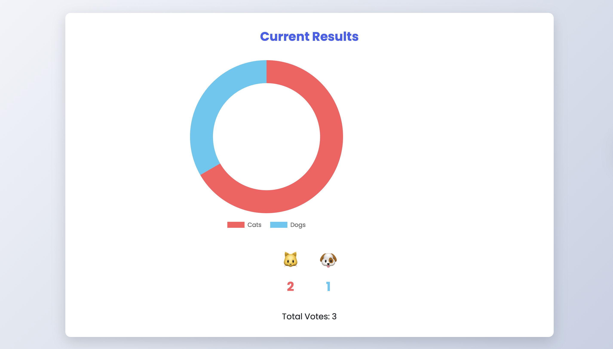

# CatsOrDogs – IaC-Driven Voting application with AWS Infra (Terraform, CloudFormation, Ansible) 🐾🐾

CatsOrDogs is a fullstack containerized voting application that allows users to choose between Cats and Dogs after submitting their name and email. The app stores votes in a PostgreSQL database and displays real-time results using a pie chart. The infrastructure is completely automated and provisioned using Infrastructure as Code (IaC) — including VPC, subnets, NAT, EC2, ALB, Minikube, and Kubernetes — via **Terraform**, **CloudFormation**, and **Ansible**. CI/CD is handled via **GitHub Actions** for building, scanning, and deploying the app.

---

## 📑 Table of Contents

- [Features](#features)
- [Tech Stack](#tech-stack)
- [Project Structure](#project-structure)
- [Architecture](#architecture)
- [Screenshots](#screenshots)
- [CI/CD Pipeline](#cicd-pipeline)
- [Local Setup (Docker)](#local-setup-docker)
- [Kubernetes Deployment](#kubernetes-deployment)
- [AWS Infrastructure as Code](#aws-infrastructure-as-code)
- [Secrets Management](#secrets-management)
- [Demo](#demo)
- [Project Structure](#project-structure)
- [Author](#author)

---

## ✨ Features

- 🗳️ Voting between Cats or Dogs
- 👤 Collects user name and email before voting
- 📊 Pie chart visualization of results
- 🐳 Dockerized with persistent volumes
- 🛠️ Kubernetes manifests for cod and postgres
- ☁️ Full infrastructure built with Terraform, CloudFormation, Ansible
- 🔁 GitHub Actions for CI/CD (build, scan, push, deploy)
- 🔐 Secure secrets via `.env` and Kubernetes Secret

---

## 🧰 Tech Stack

| Layer          | Tools / Technologies                             |
|----------------|--------------------------------------------------|
| Frontend       | HTML, CSS, JavaScript                            |
| Backend        | Go (net/http)                                    |
| Database       | PostgreSQL                                       |
| Containerization | Docker, Docker Compose                         |
| Orchestration  | Kubernetes (Minikube on EC2)                     |
| Infrastructure | Terraform (VPC, EC2, NAT), CloudFormation (ALB), Ansible (Minikube) |
| CI/CD          | GitHub Actions, Trivy                            |
| Secrets        | `.env`, Kubernetes Secrets                       |

---

## 🗂️ Project Structure

```plaintext
CatsOrDogs/
├── ansible/                          # Ansible playbook for setting up Minikube
│   └── playbook.yaml
├── aws-infra/                        # Terraform and CloudFormation IaC setup
│   ├── .terraform/
│   ├── .terraform.lock.hcl
│   ├── alb-cfn.yaml                  # CloudFormation template for ALB
│   ├── ec2.tf
│   ├── internet_nat.tf
│   ├── outputs.tf
│   ├── provider.tf
│   ├── route_tables.tf
│   ├── security_groups.tf
│   ├── subnets.tf
│   └── vpc.tf
├── backend/                          # Backend logic (Go)
├── cod-data/                         # Local volume mount for data persistence
├── database/                         # DB connection, init logic
├── docs/                             # Architecture and UI screenshots
│   ├── architecture.png
│   ├── screenshot1.png
│   ├── screenshot2.png
│   └── screenshot3.png
├── frontend/                         # HTML/CSS/JS frontend files
├── Kubernetes/                       # Kubernetes manifests
│   ├── cod-deployment.yaml
│   ├── cod-service.yaml
│   ├── postgres-deployment.yaml
│   ├── postgres-service.yaml
│   ├── postgres-pv.yaml
│   ├── postgres-pvc.yaml
│   └── postgres-secret.yaml
├── .env                              # Environment variables (local only)
├── .github/                          # GitHub Actions workflows
│   └── workflows/
│       └── ci.yaml
├── .gitignore
├── docker-compose.yaml               # Local dev stack (Go + Postgres)
├── Dockerfile                        # Builds backend Docker image
└── README.md
```

---

## 🏗️ Architecture



---

## 📸 Screenshots

> 📷 UI snapshots of the voting flow:

  
  


---

## ⚙️ CI/CD Pipeline

GitHub Actions CI/CD automates the entire flow:

1. 🐳 **Build Docker image**
2. 🛡️ **Scan image with Trivy**
3. 🚀 **Push image to Docker Hub**
4. ☸️ **Deploy to Minikube running on EC2**

```yaml
# .github/workflows/ci.yaml

- name: Docker build & push
- name: Trivy scan
- name: Deploy to K8s
```

---
## .env.example
```
DB_HOST=localhost/host.docker.internal/database
DB_PORT=5432 (your db port)
DB_USER=(your db user)
DB_PASSWORD=(your postgres password)
DB_NAME=(your database name)
```

## postgres-secret.example.yaml

```
apiVersion: v1
kind: Secret
metadata:
  name: postgres-secret
type: Opaque
data:
  POSTGRES_USER: anscGdssSE  # (put your encoded values here)
  POSTGRES_PASSWORD: c2hsgadafkgsdg== 
  POSTGRES_DB: Y3JvbfasbngnRlcg== 

  # echo -n "your value" | base64
```

---

## 💻 Local Setup (Docker)

```bash
# Clone the repo
git clone https://github.com/nsahil992/CatsOrDogs
cd CatsOrDogs

# Copy and configure env
cp .env.example .env

# Start the stack
docker compose up --build

```

---

## ☸️ Kubernetes Setup

```
# Apply Postgres manifests first
kubectl apply -f postgres-pvc.yaml -f postgres-secret.yaml -f postgres-service.yaml -f postgres-deployment.yaml -f postgres-pv.yaml -n catsordogs

# Apply CronOps manifests
kubectl apply -f cod-deployment.yaml -f cod-service.yaml -n catsordogs

```

---

## ☁️ AWS Infrastructure as Code

The entire infrastructure is automated using IaC:

| Tool               | Role                                                     |
| ------------------ | -------------------------------------------------------- |
| **Terraform**      | Provisions VPC, public/private subnets, NAT Gateway, EC2 |
| **CloudFormation** | Configures Application Load Balancer (ALB) via template  |
| **Ansible**        | Installs Minikube and Kubernetes on EC2 instance         |

You can reproduce this entire setup with a single terraform apply and Ansible playbook.

---

## 🔐 Secrets Management


✅ .env is used for local development only and is never committed to GitHub
✅ Kubernetes Secrets are defined in postgres-secret.yaml (base64-encoded)
🔒 You must create secrets locally 

---

## 📽️ Demo

[](https://youtu.be/abcd1234xyz)

> 🔗 Click the image above to watch a 5-minute walkthrough of CronOps in action.

---

## 👤 Author

Sahil – DevOps & SRE enthusiast building useful systems

- [GitHub](https://github.com/nsahil992)
- [LinkedIn](https://linkedin.com/in/nsahil992)

---

⭐ Hit the star if you loved this project!


